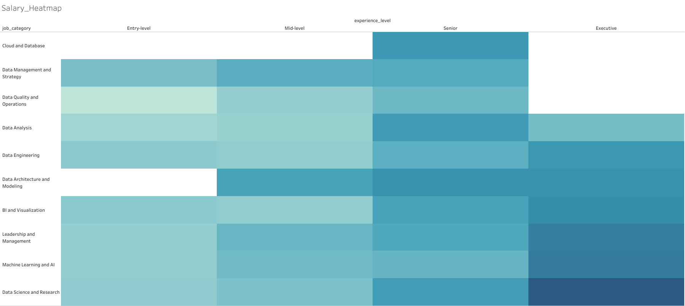
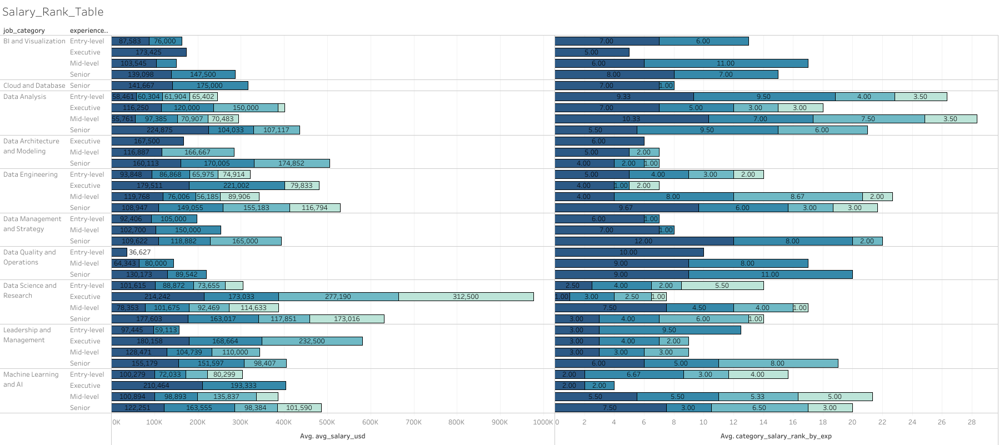
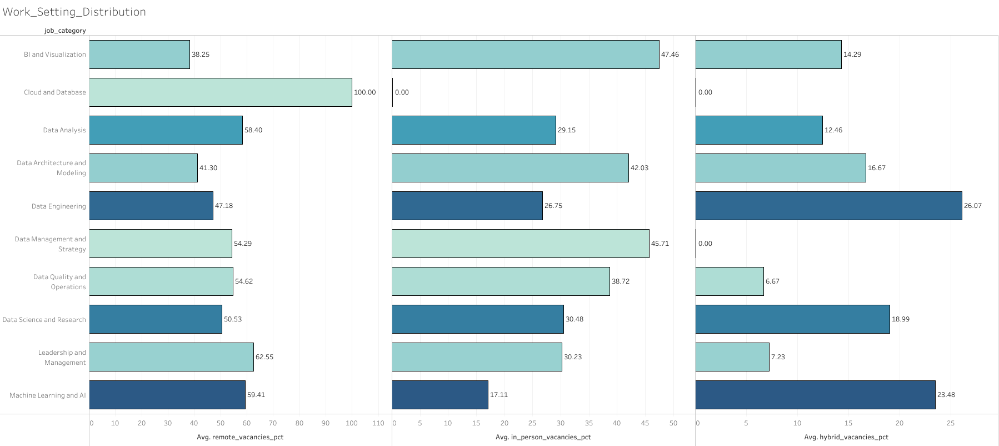
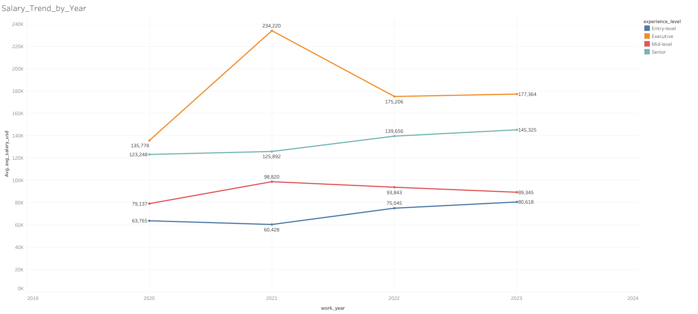
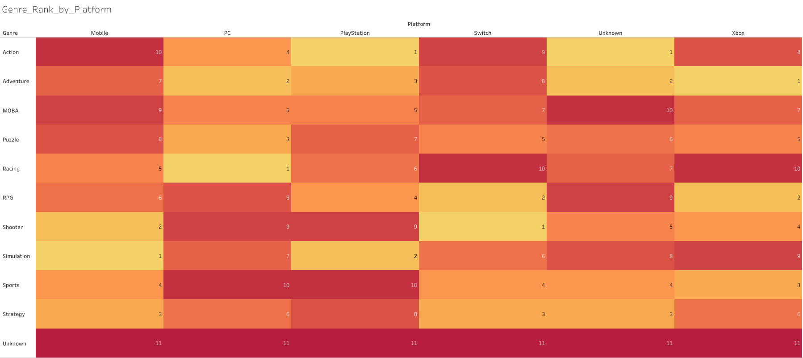
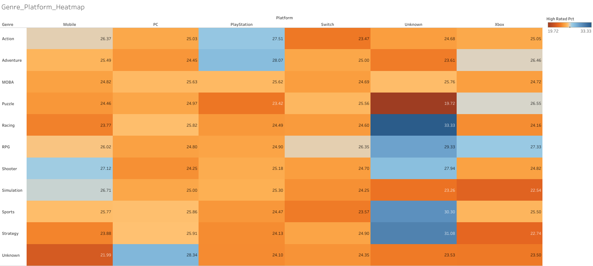
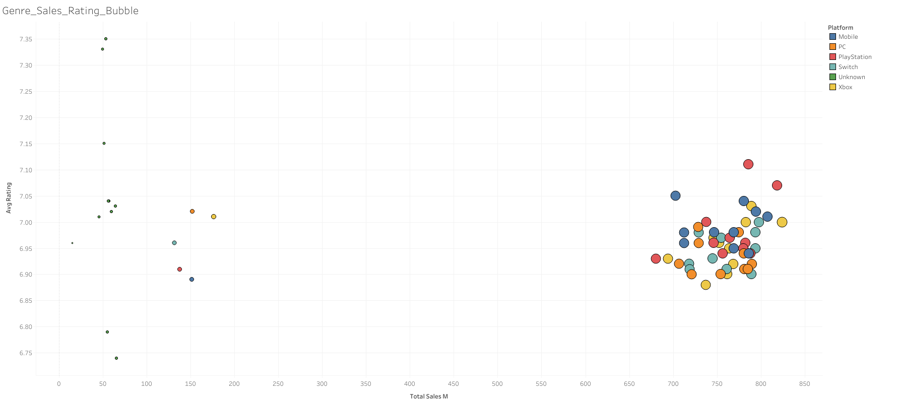
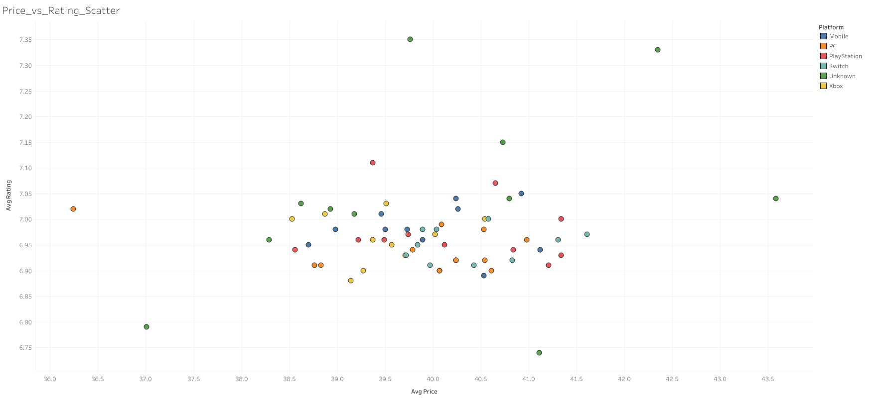
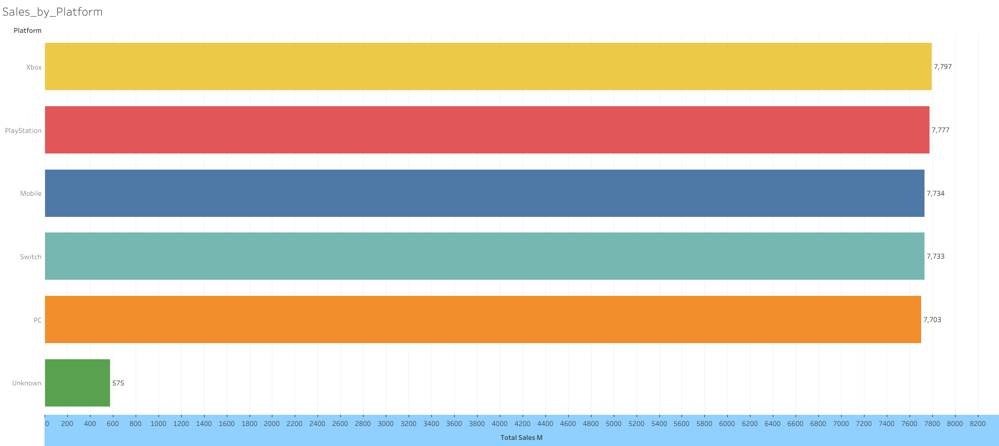

Pet-Project

Data cleaning & analysis pipeline built with PostgreSQL, Python (Pandas), and Docker — following a Bronze → Silver → Gold architecture (raw → staging → marts).

Status

✅ Data ingestion (raw layer) ✅ Data cleaning & transformation (staging layer) ✅ Analytical views with business metrics (marts layer) ✅ Visualization (Tableau)

Tech Stack
PostgreSQL — database, running in Docker
Python / Pandas — data ingestion from CSV into PostgreSQL
SQL — CTEs, window functions (ROW_NUMBER, RANK, LAG), CASE WHEN, COALESCE, NULLIF
Docker — local PostgreSQL environment
Git — version control
Tableau — dashboards
Datasets

Two independent datasets, each with its own cleaning and metrics pipeline:

1. Data Jobs Market (jobs/)

Job listings in the data industry (job title, category, salary, experience level, work setting, location).

2. Games Sales (games/)

Intentionally messy synthetic dataset simulating real-world data quality issues: inconsistent casing, mixed date formats, NULLs, duplicates, and outliers.

Architecture

Bronze → Silver → Gold → BI, orchestrated manually via Python (ingestion) and SQL (transformations):

CSV files
(games_sales_raw.csv, jobs_in_data.csv)
        │
        │  ingest.py  (Python / Pandas)
        ▼
┌────────────────────────────────────────────┐
│ RAW  (Bronze)                               │
│ raw.games_sales, raw.jobs_in_data           │
│ loaded as-is, no transformation             │
└────────────────────────────────────────────┘
        │
        │  games_cleaned.sql / jobs_cleaned.sql
        ▼
┌────────────────────────────────────────────┐
│ STAGING  (Silver)                           │
│ staging.games_sales_cleaned                 │
│ staging.jobs_in_data_cleaned                │
│ deduplicated, normalized, typed             │
└────────────────────────────────────────────┘
        │
        │  games_metrics.sql / jobs_metrics.sql
        ▼
┌────────────────────────────────────────────┐
│ MARTS  (Gold)                               │
│ marts.games_market_analytics                │
│ marts.it_market_comprehensive_analytics     │
│ aggregated views with business metrics      │
└────────────────────────────────────────────┘
        │
        │  Tableau (.twbx)
        ▼
┌────────────────────────────────────────────┐
│ VISUALIZATION                               │
│ Tableau/jobs/, Tableau/games/ dashboards    │
└────────────────────────────────────────────┘

Each dataset (jobs, games) moves through all four layers independently, with its own cleaning script and its own metrics/marts view.

Data Cleaning Highlights

Jobs pipeline:

Deduplication via ROW_NUMBER() on key fields
Salary ranking within category/experience level via RANK()
Year-over-year salary comparison via LAG()
Safe percentage growth calculation (division-by-zero protection via NULLIF)

Games pipeline:

Platform name normalization (handles inconsistent casing: PC, pc, Pc, etc.)
Multi-format date parsing (ISO, US, EU, abbreviated years, text-based months) via regex pattern matching
Outlier detection for price, rating, and sales figures
NULL values preserved as NULL (not silently converted to 0) in the cleaned layer; explicit COALESCE to 'Unknown' / 0 only applied at the aggregation (marts) layer where needed for reporting
How to Run
Start PostgreSQL in Docker (container must be running on port 5433)
Set the database password as an environment variable:
bash
   export DB_PASSWORD="your_password_here"
Run python3 ingest.py to load raw CSVs into the raw schema
Execute jobs/jobs_cleaned.sql → jobs/jobs_metrics.sql
Execute games/games_cleaned.sql → games/games_metrics.sql
Query the resulting views:
sql
   SELECT * FROM marts.it_market_comprehensive_analytics LIMIT 132;
   SELECT * FROM marts.games_market_analytics LIMIT 66;
Dashboards

Built in Tableau on top of the marts layer. Packaged workbooks (.twbx) and screenshots are in Tableau/.

Data Jobs Market

(Global_IT_Data_Jobs_Benchmark_v2026_1.twbx)

Games Sales

(Video_Games_Market_Performance_Dashboard_v2026_1.twbx)

